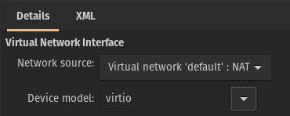

# Problems
## Finding "perfect" GPU
### **Problem**
Most of you probably think that I'm talking about the guest GPU for my virtual machine, but I'm not. This problem is about my host GPU since my Vega 56 seems quite good for a Windows VM. So at the beginning I wanted to use a GT 710 but it only has one DVI and one HDMI port and my monitors do not support DVI. Additionally the graphics card has to handle a 3440x1440p @75Hz ultrawide display and the HDMI port of the GT 710 does not have the needed bandwidth.  
The second card I wanted to use was an older R9 290. Unfortunately that card didn't work at all. Neither Windows nor the BIOS recognized the card so I decided to buy a new one. Since I am using Linux as my host OS I bought an AMD card. To be precise, it was an RX 550 with one HDMI, DP and DVI port. That card should be enough for my purpose, especially because I won't need an extremely well performing card for Pop!_OS.
### **Solution**

---

## B550 board and its IOMMU groups
### **Problem**
**I**nput-**O**utput **M**emory **M**anagement **U**nit or in short IOMMU connects devices that are able to access the memory directly (DMA-capable) ot an address of the main memory. I really don't want to get into details and therefore I will only explain all technical background information concercing this problem.
Nonetheless, the problem has its origin in the B550 chipset of my mainboard. Unfortunately, the B550 chipset
puts all lanes connected to it into one IOMMU group. In my case it's two PCIe slots, the ethernet controller an NVMe slot and some more stuff. But when passing a device, e.g. my GPU, to a VM I have to pass everything of exact that IOMMU group also to my VM. Meaning, that if I wanted to use my guest GPU in the second or third PCIe slot, I would have to pass everything else too. Luckily, the first PCIe slot is directly connected to the CPU. That's the reason why I put my Vega into the first slot. It seemes to work for now but who knows what problems I will get into within the next weeks.
### **Solution**

---

## USB devices and audio
### **Problem**
Of course, I also need to pass through some USB devices like a keyboard or a mouse and my audio to use a microphone or
some headphones. Passing through a keyboard and a mouse is quiet easy but at first, I had some problems with my
controller and I really need to check how I can use my normal audio devices within the VM.
### **Solution**

---

## Anti Cheats
### **Problem**
The primary reason why I really want such a machine is because of the comfortable way of using Linux for daily stuff
and Windows mostly for gaming. I'm not only talking aboout single player games, no, the games I want to play also
include several mutliplayer games. But multiplayer games always bring something with them and that is anti cheat
software. The are quite important for some games and without them it would be definitely hard to play many games
without running into cheaters and so on. On the other hand they have been a problem for Linux users for a long time
and won't allow most multiplayer games to run under Linux. Eventhough I will play in a VM, some anti cheats still
kick or even ban your from a small amount of games since the developers do not really like people playing their
game in a VM. Luckily there are workarounds to bypass those anti cheats from detectin my VM and I will test them for
sure. Therefore [this file](games.md) contains games that I tested so far, how my machine performed, what problems
occured and how the anti cheat reacted to my VM.
### **Solution**

---

## AMD's reset bug
### **Problem**
As you should already know, I'm using a Vega 56 for my guest OS. Most things should work fine and the performance is 
not that worse compared to a normal Windows machine. But there's one problem with AMD GPUs when it comes to the vfio
binding. It's called the "reset bug" because of following problem: Most non current gen GPUs do not reset once you
shutdown the guest. This means that you cannot use the card again if you want to boot the guest again. You simply just
won't have any output from it and therefore the whole reason of using a separate graphics card for your VMs becomes
obsolet. Then you have to restart your whole machine and to be honest, if you would keep it like that you could also
set up a dual boot. It would probably be the same at the end. Some cards, really depending on the generation and the
BIOS of the card, can be passed through multiple times without rebooting if you do some workarounds. My Vega 56 suffers from that bug and before I'm not able to buy a new GPU, I have to check if I can find a fix for it.
### **Solution**
Surprisingly the bug just went away without doing something against it. I'm not sure what fixed it since I did not
change anything that would be able to reset the GPU after closing the VM. Maybe my dual boot with Pop!_OS and
Windows 10 has some impact on the graphics card. It's also possible that the vfio driver that I recently
installed in my Windows VM changed some stuff but as I already said, I cannot tell what really solved the problem.
Of course, I will update this section as soon as I have more information about it.

---

## Upload Speed
### **Problem**
After I tested some general things I wanted to download some games and play them. So I would have some comparisons
to my actual Windows system. Therefore I made a speedtest to measure my download and upload speed but I realized
that my upload was only about 1 Mbit/s eventough it should be about 40 Mbit/s. I wondered what caused that
especially because of my download being as fast as always. Even my host OS was able to upload data at a speed
of 40 Mbit/s, so I was sure that my VM must have a problem.
### **Solution**
I found out that I need to change something in my VM setting in the virt-manager. The network interface controller
(NIC) has to be set on ``virtio`` and not ``e1000e`` or anything else.

---

